# 👋 Olá, eu sou o Ari Silva

### Full Stack Developer

Construindo aplicações web modernas, performáticas e fáceis de manter.

 

---

## 👨‍💻 Sobre mim

Desenvolvedor Full Stack focado em criar aplicações web modernas e soluções que vão da interface até infraestrutura e deploy.

- ⚡ Front-end com **Next.js, React e TypeScript**
- 🧠 Back-end com **Node.js, NestJS, .NET e Strapi**
- 🗄️ Bancos de dados com **PostgreSQL**
- 🐳 Infraestrutura com **Docker, Cloudflare e CI/CD**
- 🤖 IA e automação aplicadas ao desenvolvimento
- 🚀 Interesse em arquitetura, performance e escalabilidade

---

## 🛠️ Stack

---

## 📊 GitHub

---

## 🐍 Contribuições

<picture>
  <source
    media="(prefers-color-scheme: dark)"
    srcset="https://raw.githubusercontent.com/AriSilva94/AriSilva94/output/github-contribution-grid-snake-dark.svg"
  />
  <source
    media="(prefers-color-scheme: light)"
    srcset="https://raw.githubusercontent.com/AriSilva94/AriSilva94/output/github-contribution-grid-snake.svg"
  />
  
</picture>

---

### ☕ Código, café e boas ideias.

